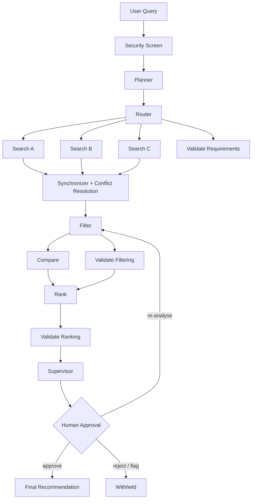

# Workflow diagram (Mermaid)

```mermaid
flowchart TD
    Q[User Query] --> S[Security Screen]
    S --> P[Planner]
    P --> R[Router]
    R --> SA[Search A]
    R --> SB[Search B]
    R --> SC[Search C]
    R --> VR[Validate Requirements]
    SA --> SY[Synchronizer + Conflict Resolution]
    SB --> SY
    SC --> SY
    SY --> F[Filter]
    F --> C[Compare]
    F --> VF[Validate Filtering]
    C --> RK[Rank]
    VF --> RK
    RK --> VK[Validate Ranking]
    VK --> SUP[Supervisor]
    SUP --> H{Human Approval}
    H -->|approve| FIN[Final Recommendation]
    H -->|reject / flag| W[Withheld]
    H -->|re-analyse| F
```

Retry loop (per agent): `Execute -> success? -> yes: continue | no: recoverable & attempts left? -> retry : failure handling (Supervisor)`
